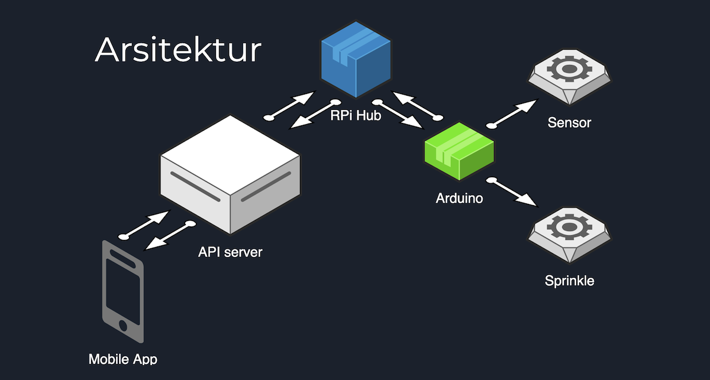

# SmartFarm API & Hub

Repository ini menyimpan source API dan Hub yang digunakan dalam workshop SmartFarm Pascal-ID.

Penekanan pada konsep dan pembelajaran, bukan untuk penggunaan di level produksi.

## Arsitektur

Arsitektur sistem ini menunjukan bahwa terdapat beberapa seksi perangkat:
- _Device controller_, dengan menggunakan arduino. Untuk membaca dan mengendalikan sensor/motor.
- Manajemen Hub, menggunakan Rasberry Pi. Hub ini menghubungkan antara _end-user_ yang menggunakan aplikasi mobile guna membaca dan mengendalikan sensor yang dilayani oleh _Device Controller_. 
Proses komunikasi dilakukan melalui API (_Application Programming Interface_)
- API Server, sebagai pusat logic kendali dari keseluruhan sistem.
- Aplikasi (mobile). Antar muka akhir pengguna dalam memantau kondisi **Smart Farm**-nya.

* Belum termasuk dashboard.

## Instalasi

### Prerequisites

- Free Pascal Compiler, [https://www.freepascal.org/](https://www.freepascal.org/)
- FastPlaz framework, [http://fastplaz.com/](http://fastplaz.com/)

### Compiling

- [Build API](docs/Build-API.md)
- [Build Hub (Rasberry Pi)](docs/Build-API.md)

## Detail Penggunaan Endpoint API

- [Station List](docs/Station.md)
- [Node](docs/Node.md)
- [Node History](docs/Node-History.md)
- [Schedule](docs/Schedule.md)
- [Konvensi Transmisi Data](docs/Convention.md)

Thanks

