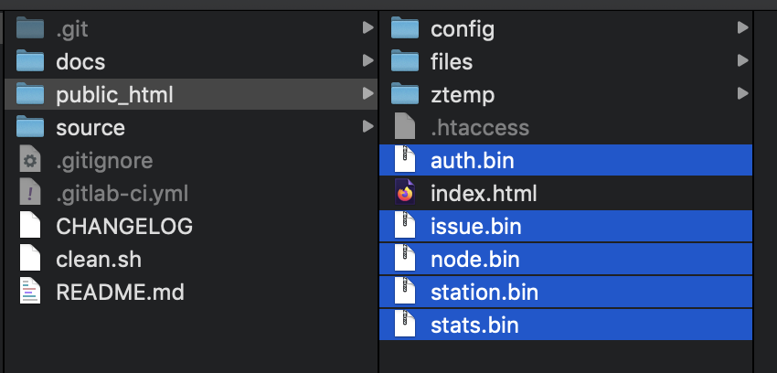

# Build API

Ada beberapa cara untuk melakukan kompilasi API Engine ini, bisa melalui IDE Lazarus, atau melalui terminal dengan menggunakan build script yang sudah kami sediakan. Hasil kompilasi akan ditemukan di folder `public_html`.


Jika dilakukan melalui IDE Lazarus, cukup buka masing2 file project yang ada di folder `source/api/` lalu lakukan kompilasi.

Berikut ini langkah-langkah yang harus anda lakukan jika memilih cara melalui terminal.

```bash
$ mkdir -p SmartFarm/source/vendors
$ cd SmartFarm/source
$ git clone https://github.com/pascal-id/Smart-Farm.git

# install vendors
#   change to branch development if needed

$ cd vendors
$ git clone -b development https://github.com/fastplaz/fastplaz.git

# kompilasi
$ ../Smart-Farm/source/api
$ ls *lpr
auth.lpr issue.lpr node.lpr schedule.lpr station.lpr stats.lpr
$ ./build.sh auth
$ ./build.sh issue
$ ./build.sh node
$ ./build.sh schedule
$ ./build.sh station
$ ./build.sh stats

```

Dan, hasilnya akan terbentuk file-file seperti ini:



## Konfigurasi API

Buka file ```public_html/config/config.json```, sesuaikan isinya dengan kebutuhan Anda, khususnya di bagian database.

```json
  "database": {
    "default": {
      "driver": "MySQL 5.7",
      "hostname": "localhost",
      "port": "",
      "username": "root",
      "password": "root",
      "database_name": "smartfarm",
      "prefix": "",
      "library": ""
    }
  }
```


Selamat mencoba.
